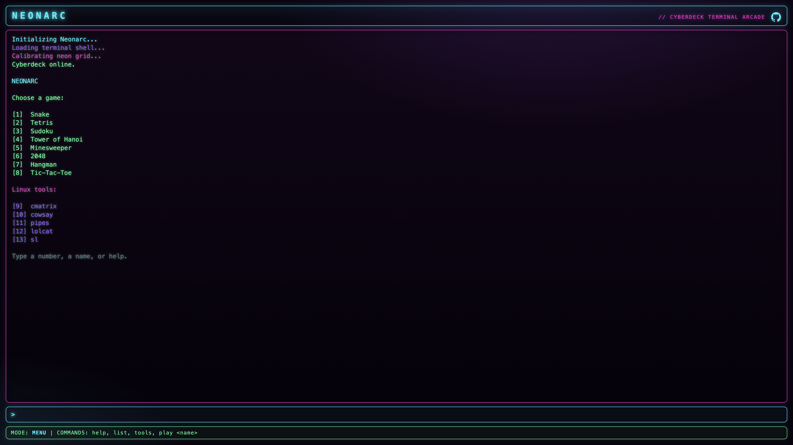
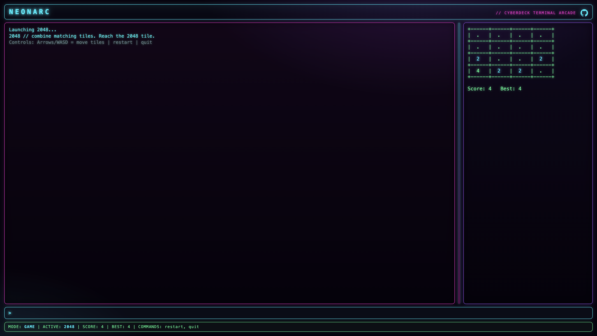
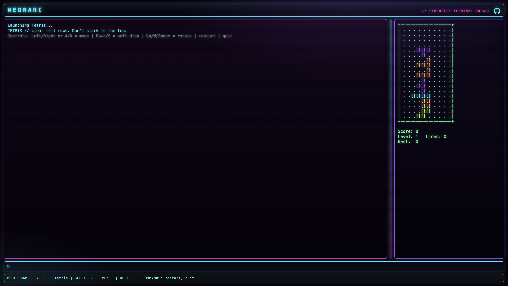
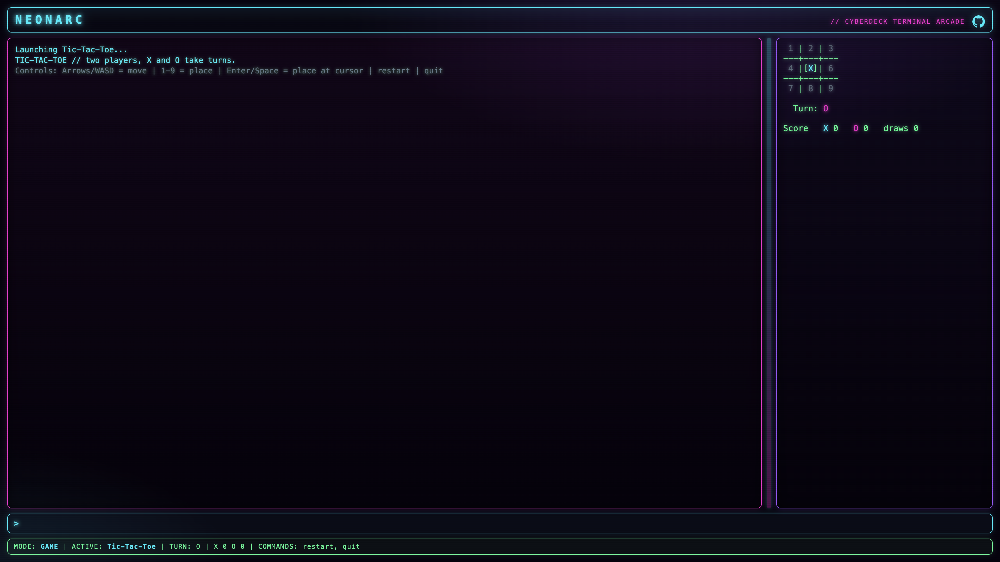
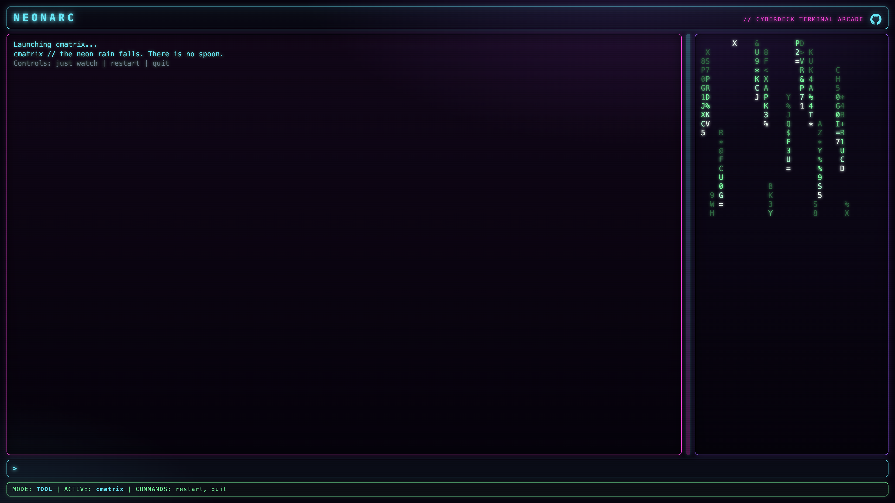

# NEONARC

> A compact cyberpunk neon **terminal arcade** — seven classic mini-games and a handful of retro Linux terminal toys, all inside a single self-contained `index.html`. No build tools, no dependencies, no CDNs. Just open the file.

### [Play online →](https://atahan99.github.io/NeonArc/)



## Overview

NeonArc boots into a neon cyberdeck terminal. You get a short boot sequence, then a menu where you pick a game or tool by typing a **number**, a **name**, or a **command**. Everything renders as glowing DOM text with scanlines, a CRT flicker, and a blinking cursor — no `<canvas>`, no images, no external fonts.

The whole project is one HTML file you can open directly in any modern browser.

## Features

- **Single file** — all HTML, CSS, and JavaScript embedded in one `index.html`.
- **Zero dependencies** — no frameworks, libraries, CDNs, build step, or package manager.
- **Cyberpunk terminal UI** — neon cyan / magenta / purple / green palette, glow, scanline overlay, CRT flicker, blinking cursor.
- **Command shell** — type numbers, names, or commands (`help`, `list`, `tools`, `play <name>`, `restart`, `quit`, ...).
- **Color-coded rendering** — each game colors its pieces distinctly (Tetris blocks, 2048 tiles, Snake, Sudoku digits, Hanoi disks, Minesweeper numbers).
- **Resizable layout** — drag the neon splitter to rebalance the terminal and the game viewport.
- **Persistent best scores** via `localStorage` (Snake, Tetris, 2048).
- **Responsive** — stacks vertically on narrow screens.

## Games

| # | Game | Description |
|---|------|-------------|
| 1 | Snake | Classic neon snake with food, growth, and a saved best score. |
| 2 | Tetris | Falling tetrominoes with rotation, line clears, levels, and best score. |
| 3 | Sudoku | A built-in 9x9 puzzle with fixed clues, duplicate highlighting, and win detection. |
| 4 | Tower of Hanoi | Move the stack to tower 3; supports `restart 3`–`restart 7` disk counts. |
| 5 | Minesweeper | 8x8 grid, 10 mines, flags, flood-fill reveal, first-click safety. |
| 6 | 2048 | Merge tiles to reach 2048, with score and best score. |
| 7 | Hangman | Guess the hidden word one letter at a time. |
| 8 | Tic-Tac-Toe | Two-player hot-seat X vs O with a running scoreboard. |

## Linux tools

Retro terminal toys, in their own menu category:

| # | Tool | Description |
|---|------|-------------|
| 9 | cmatrix | Falling neon "code rain". |
| 10 | cowsay | A neon ASCII cow that says whatever you type. |
| 11 | pipes | The classic pipes screensaver in neon. |
| 12 | lolcat | Animated rainbow text. |
| 13 | sl | A steam locomotive rolls across the screen. |

## Getting started

No install. No server required.

```bash
git clone https://github.com/atahan99/NeonArc.git
cd NeonArc
open index.html      # macOS
# or: xdg-open index.html   (Linux)
# or just double-click index.html
```

## Commands

Type these in the prompt at any time:

```
help              show available commands
list              show all games and tools
tools             show just the Linux tools
menu              return to the main menu
clear             clear the terminal output
about             about NEONARC
quit              exit the current game/tool, back to the menu
restart           restart the current game/tool (e.g. restart 5 for Hanoi)
play <name>       launch by name (e.g. play snake, play cmatrix)
```

You can also just type a **number** (`1`–`13`) or a **name** (`snake`, `tetris`, `2048`, `mines`, `matrix`, `cow`, `train`, ...).

## Controls

Controls are shown when each game starts. In general:

- **Snake / Tetris / 2048** — Arrow keys or WASD.
- **Sudoku / Minesweeper / Tic-Tac-Toe** — Arrows/WASD to move the cursor; numbers/Enter/Space to act.
- **Tower of Hanoi** — type a move like `1 3` (move top disk from tower 1 to tower 3).
- **Hangman / cowsay / lolcat** — type text (a letter to guess, or a phrase) and press Enter.
- **restart** / **quit** work in every game.

## Screenshots

| 2048 | Tetris |
|------|--------|
|  |  |

| Tic-Tac-Toe | cmatrix |
|-------------|---------|
|  |  |

## Architecture

A small **shell** handles the boot sequence, terminal output, command parsing, mode switching, the status bar, keyboard routing, and the draggable splitter. It is completely separate from the games.

Each game/tool is a self-contained object in a registry with a common interface:

```js
{
  id, name, description,
  start(), stop(), restart(),
  render(), update(),
  handleKey(event),   // realtime / cursor input
  handleCommand(text) // text commands (Hanoi moves, Hangman guesses, cowsay/lolcat text)
}
```

Real-time games (Snake, Tetris) and animated tools (cmatrix, pipes, lolcat, sl) use `setInterval` cleared on `stop()`. Grids are drawn as monospace text with colored `<span>`s.

Best scores are stored under keys like:

```
neonarc.snake.best
neonarc.tetris.best
neonarc.2048.best
```

## Browser support

Any modern evergreen browser (Chrome, Edge, Firefox, Safari). Uses only standard DOM APIs, CSS, and `localStorage`.

## License

[MIT](LICENSE) © atahan99
